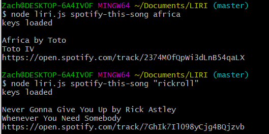
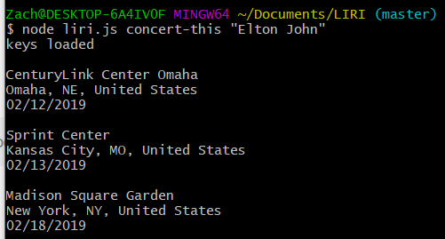
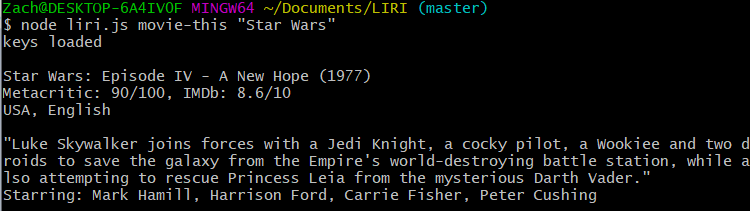
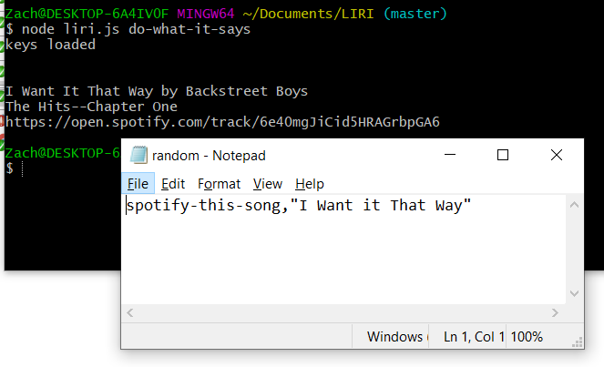

# LIRI
a little node.js command line tool for a few different purposes

## Features
There are four commands this tool responds to:

### 1. spotify-this-song
Enter a song name, and the command line will return information on the song, as well as a link to listen on Spotify.

### 2. concert-this
Enter an artist, and this tool will return dates and locations of upcoming concerts.

### 3. movie-this
Enter a movie, and this tool will give you information on the movie.

### 4. do-what-it-says
This command performs whatever command is written in the random.txt file.

